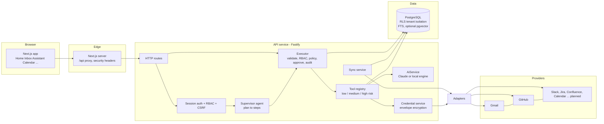

# Architecture

AI Work Hub reads from the tools a company already uses, ranks and explains what needs attention, drafts replies, and runs actions on the user's behalf. The user stays in control: reads and drafts run freely, anything with an outside effect waits for approval.

This document covers product, system, agents, integrations, data, UI, memory, approvals and deployment. Security is in [SECURITY.md](SECURITY.md), endpoints in [API.md](API.md), and phasing in [ROADMAP.md](ROADMAP.md).

**Status key.** Everything marked *built* exists in this repository and is covered by tests or was exercised end to end. *Planned* means designed here, not coded.

## 1. Product architecture

| Capability | Where it lives | Status |
|---|---|---|
| Unified inbox with priority, summary, required action, deadline, filters | `services/ingest.ts`, `ai/local.ts`, `GET /inbox`, `/inbox` page | built |
| Suggested replies (short, professional, detailed, decline, accept, clarify, follow-up), editable | `suggest_replies` tool, `ReplyPanel` | built |
| Universal composer ("Reply to Rahul and tell him...") | `compose_draft` tool, Assistant page | built |
| Task detection in messages, convert to task | `extract_tasks`, `create_task` | built |
| Convert task to Jira issue | `create_jira_ticket` tool (needs Jira adapter) | tool built, adapter planned |
| Calendar view, free slots, conflict detection, create event | `find_free_slots`, `create_meeting`, Calendar page | built, stored locally until Google Calendar adapter exists |
| Meeting brief (people, history, tasks, notes, docs, talking points) | `meetingBrief` in `services/work.ts` | built |
| Meeting transcription and summaries | needs Meet or Teams transcript source | planned |
| GitHub view and natural language queries | `github_activity`, GitHub adapter (sync, search, create issue) | built |
| Jira and Confluence agents | adapters declared, no network code | planned |
| Permission-aware universal search and entity timelines | `services/search.ts` | built |
| Daily briefing and proactive suggestions (each with a reason) | `dailyBriefing`, `computeSuggestions` | built |
| Smart follow-ups (no reply after 3 days) | `computeSuggestions`, `followUpDraft` | built |
| Approval system with configurable policy | `agents/policy.ts`, `agents/executor.ts`, Admin page | built |
| Command bar | `agents/supervisor.ts`, `POST /command` | built |
| Memory (six kinds, retention, deletion) | `memories` table, `/memory` routes | schema and delete built, automatic writes planned |
| Automation builder with preview | `/automations` routes and page | stored and previewed, trigger runner planned |
| Admin console (audit, policies, users, integrations) | `/admin/*`, Admin page | built |

### Free AI

The product works with no API key and no cost. `ai/local.ts` is a rule based engine for classification, summaries, deadline parsing, task extraction, reply templates and drafting. When `ANTHROPIC_API_KEY` is set, `ai/index.ts` upgrades replies, drafts and answers to Claude. Any model failure, invalid JSON or timeout falls back to the local engine, so the UI never breaks. The UI says which engine wrote each result.

## 2. System architecture



Request path for any user action: **route, session, executor, tool, database or adapter**. Nothing skips the executor.

### Data flow: sync and enrichment

1. A user connects Gmail through OAuth 2.0 with PKCE. Tokens are encrypted and stored.
2. `syncIntegration` loads and decrypts credentials, calls `adapter.sync(ctx, cursor)` outside any DB transaction, then opens a tenant transaction.
3. `ingestMessages` upserts each item (idempotent on `(org, source, external_id)`), classifies it, and stores priority, category, required action, deadline and the ACL principals allowed to read it.
4. The new cursor (Gmail `historyId`, GitHub `since`) is saved in `sync_state`. The next run only fetches changes.

In production the sync call runs as a queue job (section 18) triggered by webhooks and a schedule. The route only enqueues.

### Stack decisions

| Layer | Choice | Reason, and where I departed from the brief |
|---|---|---|
| Frontend | Next.js, React, TypeScript | As suggested. Plain CSS, no UI framework, to keep the dependency surface small. |
| Backend | Node, TypeScript, Fastify | One language across the stack. Fastify gives schema friendly routing and good throughput. FastAPI would also work, but you would duplicate types across two languages. |
| Database | PostgreSQL 16 | Row level security gives tenant isolation that holds even when application code has a bug. Full text search is built in. |
| Vectors | pgvector, optional | Migration creates `document_chunks` only if the extension exists. Search works without it (full text). Add embeddings when you need semantic recall, not before. |
| Queue | BullMQ on Redis, planned | Sync, webhook handling and automations are I/O bound jobs at modest volume. Kafka only pays off at much higher event rates. Not in the MVP: sync runs inline. |
| Auth | Server-side sessions, OIDC SSO planned | Opaque session tokens in httpOnly cookies are revocable instantly. JWTs would make user disable and revoke harder. |
| AI | Claude API behind `AiService`, local fallback | The model only returns data. It never sees credentials or holds tools. |
| Realtime | Server-sent events planned | One-way updates (new mail, approvals) do not need WebSockets. |
| Infra | Docker, AWS (ECS Fargate, Aurora, KMS, Secrets Manager) | See section 18. |

## 3. Agent architecture

Agents are named groups of tools plus routing rules. They are not separate processes. Every agent is bound by the same executor.

| Agent | Responsibility | Tools | Status |
|---|---|---|---|
| Supervisor | Plan a request into steps, run them, merge results | all, via executor | built (rule based planner) |
| Communication | Inbox, reply suggestions, composer, sending | `list_inbox`, `suggest_replies`, `compose_draft`, `resolve_message`, `send_message` | built |
| Email | Gmail specifics (threads, sync) | shares communication tools, Gmail adapter | built |
| Calendar | Slots, conflicts, events | `list_meetings`, `find_free_slots`, `create_meeting` | built |
| Meeting | Briefs, action items | `meeting_brief`, `meeting_action_items` | built |
| GitHub | Reviews, CI, security | `github_activity` | built |
| Task | Detect, create, update | `extract_tasks`, `create_task`, `update_task`, `list_tasks` | built |
| Knowledge | Cited answers | `ask_company` | built |
| Search | Search and timelines | `search_workspace`, `build_timeline` | built |
| Workflow | Briefing, suggestions, automations | `daily_briefing`, `list_suggestions` | built |
| Security | Injection scan, RBAC, policy | enforced in executor and `security/` | built |
| Slack, WhatsApp, Jira | Provider specific actions | `create_jira_ticket` exists | planned |

### Orchestration

`agents/supervisor.ts` maps text to a plan, for example:

- "Prepare my meetings for tomorrow" gives `list_meetings(tomorrow)`, then one `meeting_brief` per result.
- "Reply to the latest Cleartrip email" gives `search_workspace`, then `suggest_replies` on the newest matching message.
- "Schedule a meeting with Kartik next week" gives `find_free_slots` over next week. The user picks a slot, which calls `create_meeting`.

The planner is deterministic and free. A model planner can replace `plan()` later. Whatever it returns still has to pass the executor, so a planner cannot widen its own permissions. A test asserts that no free-text command plans a high risk tool directly.

### The executor (the permission boundary)

`agents/executor.ts` is the only code path that runs tools. For every call:

1. Validate input against the tool's zod schema.
2. RBAC check for the tool's permission.
3. Load org approval policies and `decide()` (precedence in section 13).
4. `deny` returns `denied`. `require_approval` stores an `approval_request` and returns it. `allow` runs the tool in a savepoint.
5. Record an `agent_actions` row and a hash chained `audit_logs` entry.

Tool risk is declared in code (`agents/tools.ts`), not by the model or the request.

## 4. Integration architecture

Every connector implements `IntegrationAdapter` (`integrations/types.ts`):

```ts
connect() disconnect() sync() search() read() create() update() send() subscribe() permissions()
```

Each adapter declares `supports: Operation[]` and `status: 'ready' | 'planned'`. `requireOperation(provider, op)` rejects any operation that is undeclared or unimplemented. A contract test checks that every declared operation on a ready adapter is a real function.

| Adapter | Status | Implemented |
|---|---|---|
| Gmail | ready | connect (OAuth + PKCE), disconnect (revoke), incremental sync via `history.list` with full resync on expired history, search, read, send, subscribe (Pub/Sub watch) |
| GitHub | ready | connect, sync (notifications, repo allow list), search issues, create issue, permissions |
| Google Calendar, Slack, Jira, Confluence, Drive, Outlook, Teams, WhatsApp, GitLab, Notion | planned | manifest only (name, category, intended operations) |

Cross cutting behaviour in `integrations/http.ts`: timeouts, bounded retries on 429 and 5xx honouring `Retry-After`, jittered backoff. Gmail refreshes expired access tokens on a 401 and persists the new token through `onTokenRefresh`.

**To add an integration:** create `integrations/<name>.ts` exporting an `IntegrationAdapter`, register it in `registry.ts`, add its OAuth client env vars. The UI, Admin console, search, inbox and agents pick it up with no other change, because they work on `NormalizedMessage`, `NormalizedDocument` and `NormalizedEvent`.

**MCP.** Where a provider ships an official MCP server, wrap it as an adapter (its tools become `search`, `read`, `create`). Credentials stay in the backend adapter. The model never talks to an MCP server directly, because that would bypass the executor.

**Webhooks** (planned): `POST /webhooks/:provider/:id` verifies the provider signature against `webhooks.secret_hash`, then enqueues a sync for that integration. Gmail and Calendar watches expire, so a scheduled job renews them using `webhooks.expires_at`.

## 5. Database schema

Source of truth: `db/migrations/001_init.sql`. Tables:

- **Identity:** `organisations`, `users`, `teams`, `team_members`, `sessions`
- **Integrations:** `integrations`, `oauth_credentials`, `sync_state`, `webhooks`
- **Work data:** `contacts`, `projects`, `threads`, `messages`, `documents`, `document_chunks` (if pgvector), `tasks`, `meetings`, `meeting_participants`, `meeting_notes`, `notifications`
- **AI and governance:** `ai_suggestions`, `approval_policies`, `agent_actions`, `approval_requests`, `audit_logs`, `memories`, `permissions`, `automations`

### Tenant isolation

- Every tenant table has `org_id`. A loop in the migration enables and **forces** row level security with one policy: `org_id = current_setting('app.org_id')`.
- The API connects as `aiwork_app`, which is neither owner nor superuser, so policies always apply.
- `withOrg(orgId, fn)` opens a transaction and sets `app.org_id` locally. With no tenant set, queries return zero rows. Tests prove cross tenant reads return nothing and cross tenant writes are rejected.
- Login lookups (session token, user by email) happen before a tenant is known. They go through two narrow `SECURITY DEFINER` functions instead of weakening RLS.

### Permission-aware retrieval

`messages.acl` and `documents.acl` hold the principals allowed to read an item in the source system: `org:*`, `user:<id>`, `team:<id>`, `mailbox:<email>`, `repo:<name>`. `principalsFor(user)` computes the caller's principals, including grants and denies from `permissions`. Every search query filters `acl && principals` **in SQL, before ranking**, so unreadable content never reaches a prompt. Test: a team-restricted document is invisible to a user outside the team and appears after they join.

### Other integrity rules

- `audit_logs` is append only (trigger plus revoked UPDATE and DELETE) and hash chained per tenant.
- Messages upsert on `(org_id, source, external_id)`, so repeated syncs never duplicate.
- Generated `tsvector` columns with GIN indexes back full text search.

## 6. Repository layout

```
apps/
  api/                    Fastify API (TypeScript)
    src/
      server.ts           app bootstrap: helmet, cookies, rate limit, CORS, error handler
      config.ts           validated environment, production safety checks
      db.ts               pool, withOrg() tenant transactions
      audit.ts            hash chained audit log
      security/           crypto (envelope encryption), rbac, sanitize (prompt injection)
      ai/                 index.ts (AiService), local.ts (free engine)
      integrations/       types (adapter contract), registry, gmail, github, planned, http
      agents/             tools, executor, policy, supervisor, registry, context
      services/           ingest, search, work (briefing, slots, briefs, suggestions), sync, oauth, credentials
      routes/plugin.ts    all HTTP routes
      migrate.ts seed.ts
    tests/                unit tests plus database integration tests
  web/                    Next.js app (App Router)
    app/                  one folder per screen
    components/           Shell, Results, ApprovalCard, ui
    lib/                  api client, useApi hook
db/migrations/            SQL migrations
docs/                     this folder
docker-compose.yml  .env.example  .github/workflows/ci.yml
```

## 7. UI architecture

Next.js App Router. Every page is a client component that fetches through `lib/api.ts`, which sends cookies and the CSRF header to `/api`, proxied by `next.config.mjs` to the API. The browser talks to one origin, so cookies are same-origin. `Shell` handles sign-in, navigation, the global command bar (Ctrl+K) and the pending-approval badge. Result rendering is shared: `components/Results.tsx` turns a tool name into a view, which the Assistant, Inbox and Home pages reuse.

### Home wireframe

```
+-----------+--------------------------------------------------------------+
| AI Work   | [ Ask your company anything...  Ctrl+K ]   [1 awaiting approval]|
| Hub       +--------------------------------------------------------------+
| Home      | Welcome, Javed                                               |
| Inbox     | +-- Waiting for your approval (shown only when non-empty) ---+|
| Assistant | | what will be sent, editable body  [Approve and send][Reject]||
| Calendar  | +------------------------------------------------------------+|
| Meetings  | +-- Today's briefing --+ +-- AI suggestions --+ +-- Needs reply +|
| Tasks     | | counts, attention    | | each with "Why:"   | | top 5        ||
| Projects  | | now / can wait /     | |                    | |              ||
| GitHub    | | blocked              | |                    | |              ||
| Jira      | +----------------------+ +--------------------+ +--------------+|
| Knowledge | +-- Upcoming meetings --+ +-- Priority tasks --+ +-- Waiting ---+|
| Integr.   | +-- GitHub activity ---------------------------------------------+
| Automat.  |
| Admin     |
+-----------+
```

Inbox is a two pane layout: prioritised list with filter tabs on the left, selected item with summary, detected tasks, reply options and the approval card on the right. Admin is tabbed: Audit log (with integrity check), AI actions, Approval policies, Users, Integrations. Navigation hides Admin from non-admins; the API enforces it regardless.

## 8. Authentication design

- **Now:** development sign-in (`DEV_AUTH=true`) creates a session for a seeded user. It is disabled by config validation in production.
- **Sessions:** 256 bit random token in an httpOnly, SameSite=Lax cookie (`Secure` in production). Only the SHA-256 of the token is stored. Sessions expire (12h default), and can be revoked: logout, user disable, admin action.
- **CSRF:** state changing requests must carry `X-Requested-With: awh` and a matching `Origin`. Browsers cannot send that header cross-site without a CORS preflight, and CORS only allows the web origin.
- **SSO (planned):** OIDC authorization code flow with PKCE, reusing `services/oauth.ts`. Map IdP groups to roles and teams. Support SAML through the IdP's OIDC bridge or a library. Provision users on first login (JIT) and deprovision through SCIM or session revocation.
- **MFA:** `sessions.mfa_passed` and `users.mfa_enrolled` exist. When `organisations.settings.requireMfa` is set, admin routes require `mfa_passed`. TOTP and WebAuthn enrolment are planned. With SSO, require MFA at the IdP.

## 9. OAuth integration flow

```
Browser            API                       Provider
  | GET /integrations/gmail/start             |
  |------------>| state + PKCE verifier in    |
  |             | signed httpOnly cookie (10m)|
  |<-- {url} ---|                             |
  | redirect to provider consent screen ----->|
  |<-- redirect /api/integrations/gmail/callback?code&state
  |------------>| verify cookie signature and state
  |             | exchange code + verifier ->|
  |             |<-- access + refresh tokens-|
  |             | encrypt (AES-256-GCM, per-record data key, AAD = integration id)
  |             | insert integration, audit  |
  |<-- redirect to /integrations?connected=gmail
```

Scopes are least privilege (Gmail read and send, GitHub repo read and notifications). Disconnecting revokes at the provider where supported and **deletes** the stored tokens. Refresh happens on 401 inside the adapter, and a failed refresh marks the integration `error` so the UI shows a reconnect prompt.

## 10. Permission model

Three layers, all enforced server side.

1. **RBAC** (`security/rbac.ts`). Roles: owner, admin, member, viewer. Viewers can read and draft but cannot send or write. Members can send, create tasks and meetings. Admins manage integrations, users, policy and audit. Owners additionally purge org memory and grant owner.
2. **Data ACL.** Row level security for tenant isolation, plus `acl` principals on messages and documents for per-item access (section 5). Admin restrictions on sensitive repositories apply in the GitHub adapter through `config.allowedRepos`, and through `permissions` deny rows.
3. **Tool policy.** Per tool and per risk class, set by admins (section 13). A deny blocks the tool for everyone.

## 11. Memory architecture

| Kind | Scope | Written by | Retention rule (design; the expiry job is planned) |
|---|---|---|---|
| conversation | user | assistant sessions | 30 days |
| preference | user | user settings, explicit confirmation | until deleted |
| company | org | admin or knowledge sync | until deleted |
| project | org | project sync | life of project |
| relationship | user | explicit "remember" or repeated strong signal | 180 days |
| task_history | user | task lifecycle | 1 year |

Rules: memory is **not** a copy of everything. Mailbox content stays in source tables under ACL, and is retrieved on demand. Only distilled facts go in `memories`, each with `source_ref` and `expires_at` set at write time. Users can list and delete their memories (`GET /memory`, `DELETE /memory/:id`, `DELETE /memory?kind=`, the last through the approval flow since it is high risk). An expiry job (planned) deletes rows past `expires_at`. Retention defaults live in `organisations.settings` and admins can shorten them. Automatic memory writes are planned; today the table is read, shown and deletable, and seeded with preferences.

## 12. AI agent logic and the reply pipeline

1. Message arrives, `classify()` sets priority, category, required action, deadline, summary.
2. User opens it. `suggest_replies` loads the thread (last 4 messages), the user's stored writing style, and builds the prompt.
3. All external text is normalised (control and zero width characters removed), scanned for injection patterns, and wrapped in `<untrusted id=nonce>` blocks with a random nonce the content cannot predict. The system prompt states that text inside those blocks is data.
4. The model must return JSON, validated by zod. Failure falls back to the local engine.
5. The user edits and presses "Review and send", which calls `send_message`. That is high risk, so it is parked as an approval request showing the exact payload.

## 13. Approval workflow

```
agent/user -> executeTool(send_message)
                 |-- validate, RBAC
                 |-- policy.decide()
                 v
          require_approval -> approval_requests (preview, payload_hash, expires 24h)
                 |                    |
                 |            UI shows exact payload (body editable)
                 v                    v
              reject            approve (optionally edited)
                                   |-- edited? re-validate, new hash, audit "approval.edited"
                                   |-- hash must match what was shown
                                   |-- runs as the requester with their current role
                                   v
                               tool executes, audit "tool.executed", status executed
```

Properties, each covered by an integration test: edits are what gets sent; a request can be decided once; reject runs nothing; org deny blocks the tool; `approver_role = admin` enforces four eyes (the requester cannot approve their own request); a failed tool is recorded and the transaction survives.

### Policy precedence

1. Org policy for the exact tool
2. Org policy for the risk class (`*`)
3. The user's explicit auto-run opt-in on an automation (relaxes only the built-in default)
4. Built-in default: low = allow, medium = allow and audit, high = require approval

An automation can never relax an org policy.

## 14. Automations

An automation is `{trigger, steps[]}` where each step is a tool call. `POST /automations/preview` returns every action with its agent, risk, and whether it runs without asking. Creation stores it **disabled** and the UI shows the same table before the user enables it. Templates match the three examples in the brief (important client email, after every meeting, failed deployment). Storage, preview, enable and audit are built. The runner that matches events and executes steps through `executeTool` with `origin: 'automation'` is planned (roadmap phase 2).

## 15. Testing strategy

- **Unit (pure, no DB):** crypto round trip, AAD binding and tamper detection; RBAC; policy precedence; prompt injection scan and wrapper breakout; audit chain verification; task, deadline, classification, reply and composer logic; supervisor routing for every example command in the brief; adapter contract (declared equals implemented).
- **Integration (real Postgres, `TEST_DB=1`):** RLS read and write isolation, empty tenant sees nothing, ACL filtered search, append-only audit and chain verification after real writes, the full approval lifecycle, deny policies, four eyes, tool failure isolation.
- **Planned:** provider contract tests against recorded fixtures (Gmail, GitHub), Playwright end-to-end for sign-in, reply and approve, load test of sync, and a prompt injection regression corpus run against the model path.
- **CI:** `.github/workflows/ci.yml` starts Postgres, migrates, type checks, runs all tests and builds the web app.

Run: `npm test` (unit) or `TEST_DB=1 MIGRATION_DATABASE_URL=... npm test` (all).

## 16. Local development

```bash
npm install
cp .env.example .env            # defaults work for local use
# Postgres 16 running locally, or: docker compose up db
createdb aiworkhub              # as a superuser
npm run migrate                 # needs MIGRATION_DATABASE_URL (owner)
npm run seed                    # demo org: Acme Corp
DEV_AUTH=true npm run dev:api   # http://localhost:4000
npm run dev:web                 # http://localhost:3000
```

Sign in as `javed@acme.test` (owner), `priya@acme.test` (admin, also in the Legal team) or `sam@acme.test` (member). Try Priya versus Javed searching "litigation memo" to see ACL filtering. Add `ANTHROPIC_API_KEY` to switch to Claude.

Or the whole stack: `docker compose up --build`, then `docker compose run --rm migrate npm run seed -w apps/api`. (Compose file is written but not run in this environment.)

## 17. Environment variables

See `.env.example`. Required in production: `DATABASE_URL`, `MIGRATION_DATABASE_URL`, `MASTER_KEY`, `WEB_ORIGIN`, `API_PUBLIC_URL`. `DEV_AUTH` must be `false`. Provider OAuth ids and secrets are per integration. The API refuses to start in production with `DEV_AUTH=true` or the default master key.

## 18. Deployment architecture (AWS)

```
Route 53 -> CloudFront -> ALB (WAF) -> ECS Fargate: web (Next.js)
                                    -> ECS Fargate: api (Fastify, N tasks)
                                    -> ECS Fargate: worker (BullMQ: sync, webhooks, automations)  [planned]
Aurora PostgreSQL (multi-AZ, encrypted, pgvector)   ElastiCache Redis (queues)  [planned]
Secrets Manager (OAuth client secrets, DB creds)    KMS (token wrapping key)
CloudWatch + OpenTelemetry (traces, metrics)        S3 (exports, transcripts, SSE-KMS)
```

- Private subnets for tasks and databases, security groups allow only ALB to tasks and tasks to data stores.
- `KeyWrapper` in `security/crypto.ts` is the seam for KMS: replace `localKeyWrapper` with a class whose `wrap` and `unwrap` call `kms:Encrypt` and `kms:Decrypt`. The process then never holds the master key, and each decrypt is logged by CloudTrail.
- Migrations run as a one-off task before each deploy using the owner credentials. Runtime tasks only get the `aiwork_app` credentials. Set that role's password during provisioning (the migration creates it with a development password).
- CI/CD: GitHub Actions builds images, runs the test job, pushes to ECR, runs the migration task, then updates ECS with a rolling deploy and health checks on `/health`.
- Scale: API is stateless. Add worker tasks per queue depth. Partition sync by integration to stay inside provider rate limits.
- Multi-region and data residency per tenant are out of scope for the MVP. The schema allows pinning a tenant to a regional database later.
